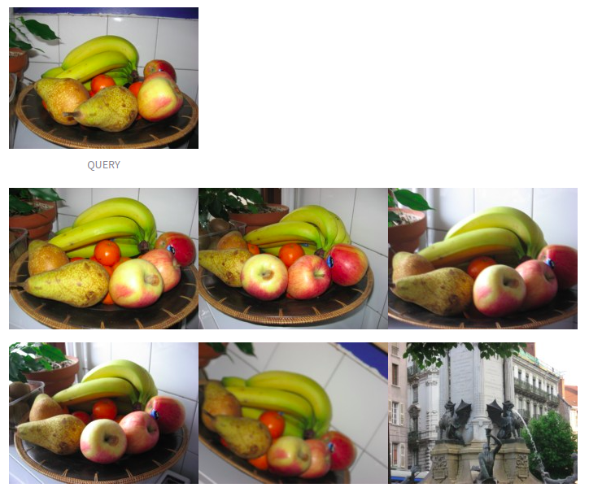

## Introduction
- <b>INRIA Holidays IR</b> is the image retrieval task on INRIA Holidays dataset. The Holidays dataset is a set of images which mainly contains some of our personal holidays photos. The remaining ones were taken on purpose to test the robustness to various attacks: rotations, viewpoint and illumination changes, blurring, etc. The dataset includes a very large variety of scene types (natural, man-made, water and fire effects, etc) and images are in high resolution. The dataset contains 500 image groups, each of which represents a distinct scene or object. The first image of each group is the query image and the correct retrieval results are the other images of the group.

    

## Methodology
- <b>Method 1:</b> using <b>color histogram</b> for extracting feature and <b>kd-tree</b> for finding nearest neighbors.
- <b>Method 2:</b> using <b>SIFT</b> for extracting feature and <b>matching</b> between query and images in dataset. 
